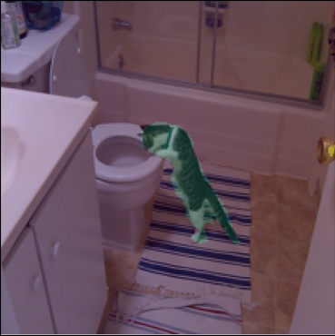
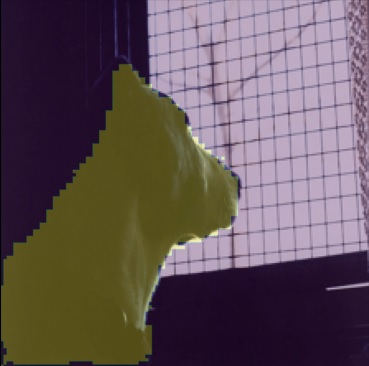
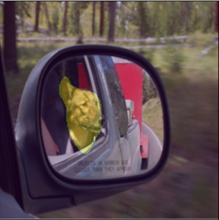

# Picture_segmentation
 
This is an AI project meant to find cats and dogs in pictures and segment them from the rest of the picture. 
Three approaches were provided, first one inspired by ParseNet(the papper is provided in the repository), second 
approach is a pretrained MobileNet to which I added a couple of layers to adjust it for the segmentation purposes, 
and the third is a Fully Convolutional neural network. The three approaches have been compared in this project, and 
also the metrics have been showed. The paper on Fully Convolutional neural network is also provided in the repository 
along with other popular segmentation strategies.

## Data
 
The data I used for training is the COCO dataset available at: https://cocodataset.org/#home 
All the analyzation, preprocessing etc. has been thoroughly described in the .ipynb file. 

## Our Goal
 
These are some of the results of the overfitted models, and these are the results we want our model to generalize well. 
We can see the model recognized a cat on the picture(blue color) and segmented it well. This is the result of a Fully Convolutional neural network.

### FCN

Here is a result of the adjusted MobileNet which successfully segmented and recognized a dog(yellow color).

### MobileNetV2

Another example of a dog segmentation by a neural network inspired by the ParseNet arhitecture

### ParseNet

